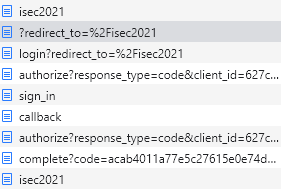

Informationssicherheit, 13. Übung
=================================

von Gruppe G35
Adrian Lindloff (lindloff), Timo Schuchmann (timo5) und Philias Borrmann (borrmann)

*******************

Aufgabe 1, 4 Punkte, Gruppe
---------------------------

Wir haben die Chrome dev tools (F12) genutzt und `preserve log` aktiviert damit die logs beim Redirect erhalten bleiben. Im Folgenden haben wir nur die `Documents` betrachten. Hier werden die HTTP-Request und Response angezeigt, die für die Anmeldung ausgeführt werden.

1. [isec2021] Aufruf der Seite  https://mattermost.informatik.uni-bremen.de/isec2021. Der Server antwortet mit einem redirct, da eine Anmeldung erforderlich ist.
2. [?redirect] Die Login-Seite von Mattermost. Hier ist der Knopf zum Anmelden ans GitLab.
3. [login?]  Beim klick auf den Knopf wird eine Anfrage an Mattermost mit path: `/oauth/gitlab/login?redirect_to=%2Fisec2021` geschickt. Mattermost schickt diese Anfrage an Gitlab und erstellt uns eine `client_id` für die `OAuth-application` von Gitlab. Wir erhalten ein redirect an GitLab mit genau dieser `client_id`.
4. [authorize?] Da wir auch nicht in gitlab angemeldet sind, kommt wieder ein redirct zu gitlab/sign_in.
5. [sign_in] Wir landen nun auf der GitLab Anmeldeseite.
6. [callback] Wir geben die LDAP Daten ein und melden uns an. Die Daten werden an gitlab.informatik.uni-bremen.de/users/auth/ldapmain/callback übermittlet. Daraufhin erhalten wir wieder einen redirect.
7. [authorize?] In dieser Anfrage an `gitlab.informatik.uni-bremen.de/oauth/authorize?` ist wieder eine `client_id` erhalten sowie eine `redirect_uri`. Gitlab überprüft, ob es sich hierbei um einer der gültigen redirect-URLs handelt. Die Anmeldung war erfolgreich (STATUS 200) und der redirect in der url: `redirect_uri=mattermost` wird aufgerufen.
8. [complete?] In diesem redirect ist nun alles nötige erhalten, um sich bei Mattermost zu autorisieren. Wir erhalten Zugang zu `/isec2021`
9. [isec2021] Schlussendlich landen wir im Mattermost channel von isec und können chatten.

* * *

**Anmeldung bei Mattermost über ein privates Fenster**

Durch das Anmelden über ein privates Fenster speichert der Browser nicht, das wir die Anmeldeseite von Mattermost und GitLab geöffnet haben. Es werden außerdem keine Cookies gespeichert, die zeigen, dass wir uns angemeldet haben. Das Passwort wird außerdem nicht für einen erneuten Login gespeichert. Eine optimale Anonymität ist dadurch jedoch nicht gewährleistet. Internet Provider sind z.B. immer noch in der Lage herauszufinden, welche Seiten im privaten Modus besucht werden. Viele Browser haben aber noch eine Anti-Tracking Funktion. Ist diese Funktion aktiviert, werden bestimmte Zeilen Code auf einer Webseite blockiert, die sonst versuchen ein Profil vom Nutzer der Seite zu erstellen. 

---
**Quellen**

- https://www.computerworld.com/article/3356840/how-to-go-incognito-in-chrome-firefox-safari-and-edge.html

- https://docs.gitlab.com/ee/integration/mattermost/#oauth2-sequence-diagram
